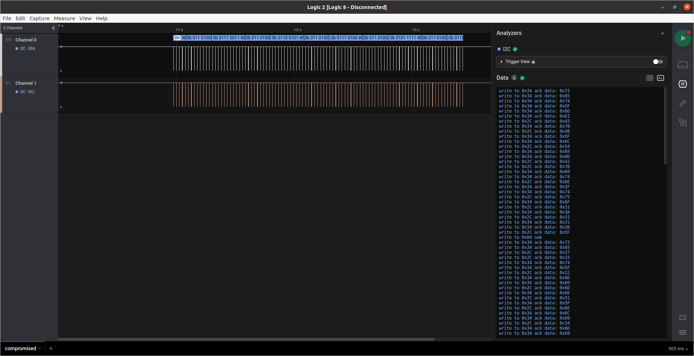

# Compromised

We are given the file [compromised.sal](compromised.sal). From the [serial logs challenge](../serial_logs) we know we need to use [Saleae's Logic 2 software](https://support.saleae.com/logic-software/sw-download).

This time the communication is across 2 channels, so I assume it's the I2C protocol. By selecting this setting we get an output that looks something like this:
```
write to 0x34 ack data: 0x73 
write to 0x34 ack data: 0x65 
write to 0x34 ack data: 0x74 
write to 0x34 ack data: 0x5F 
write to 0x34 ack data: 0x6D 
write to 0x34 ack data: 0x61 
write to 0x2C ack data: 0x43 
write to 0x34 ack data: 0x78 
write to 0x2C ack data: 0x48 
write to 0x34 ack data: 0x5F 
write to 0x34 ack data: 0x6C 
write to 0x2C ack data: 0x54 
write to 0x34 ack data: 0x69 
write to 0x34 ack data: 0x6D 
write to 0x2C ack data: 0x42 
write to 0x2C ack data: 0x7B 
write to 0x34 ack data: 0x69 
write to 0x34 ack data: 0x74 

...
```



I copy and paste all the data into VS Code, and using some regex find and replace I get the hex string
```
7365745F6D614378485F6C54696D427B69746E5F74756F313A3131305F73653733745F326D696D6E315F6E6C69346D693730745F32746F353A5F3163302B1D5D3C2B2F347E6E725E5F797A3832476233622234236B555F1603342B4A5F35010D334D0E324231003442123164565F3507207953053542376B331D1A31560551786D14216A164060513532797129742523204035256D647D5316
```
Which decodes to:
```
set_maCxH_lTimB{itn_tuo1:110_se73t_2mimn1_nli4mi70t_2to5:_1c0+.]<+/4~nr^_yz82Gb3b"4#kU_..4+J_5.
3M.2B1.4B.1dV_5. yS.5B7k3..1V.Qxm.!j.@`Q52yq)t%# @5%md}S.
```
It looks like 2 strings combines, and if we look at the original data, it seems to be communication between `0x34` and `0x2C`. By only keeping the data sent to `0x2C`, we get the flag:
```
434854427B6E7531315F3733326D316E34373032355F63346E5F383233346B5F345F3533323134315F35793537336D21403532292340257D

CHTB{nu11_732m1n47025_c4n_8234k_4_532141_5y573m!@52)#@%}
```