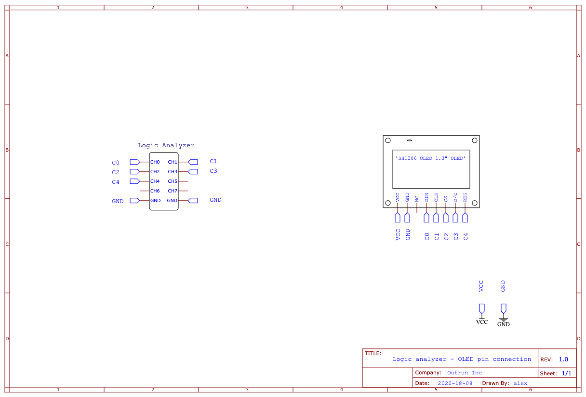

# Off the grid

We are given the file [off_the_grid.sal](challenge_files/off_the_grid.sal) along with [schematic.png](challenge_files/schematic.png). From the [serial logs challenge](../serial_logs) we know we need to use [Saleae's Logic 2 software](https://support.saleae.com/logic-software/sw-download) for the .sal file.



In the schematic we see how the logic analyzer is hooked up to a `SH1306 OLED 1.3" OLED` screen. By looking at the [description of the different pins](https://www.waveshare.com/product/displays/lcd-oled/lcd-oled-3/1.3inch-oled-a.htm) on the screen, we can correctly configure Logic 2:

* Channel 0 is connected to `DIN`, which stands for `data in`, so channel 0 is the MOSI.

* At channel 1 we have `CLK`, which is the clock.

* Channel 2 is `CS`, which stands for `Chip Select`, (called `Enable` in Logic 2).

* The other channels can be ignored.


After applying these settings I sent the exported data to my teammate. One of my teammates noticed there was text in the raw bits:


This meant that every bit represented a single pixel on the screen. In the [cleaned up data I exported](clean_exported) I noticed that every 128 bytes, there were newlines and 3 specific bytes.
```
...

11110100
11110100
00000100
11111100 // byte 127
00000000 // byte 128


10110001 // seperators, seems like they tell the screen which row is coming


00000010


00010000


00001111 // byte 1
00001111 // byte 2
00001111
00001111
00001110

...
```

Since the screen was 128*64 pixels, it made sense that each row of bits was a row in the image, and for each image it would send 8 rows, 8 at at a time. This meant that the last bit of the first byte in the first chunk would be the top left pixel, and the first bit in the last byte of the last chunk would be the bottom left pixel. There was also a total of 48 chunks, meaning that there was 6 images (48 chunks / 8 chunks per image = 6 images). Now all I had to do was create a Python script to convert the bits to images.

The script was made at a little past 2am after growing tired of the challenge, and to be truthful, I barely understand it in retrospect (*not* good code).
```py
from PIL import Image

test = open("clean_exported", "r").read().split("\n\n\n") # read the exported bits, split every 128th line(when it hits a divider; 3 newlines)
test = [x.split("\n") for x in test if len(x) != 8] # only keep the chunks, and not the seperators

for x in range(len(test)//8): # each image consits of 8 chunks
    oof = test[x*8:] # the current 8 chunks for the image

    colors = bytes([])

    # i struggled a bit with getting the bits in the correct order, this code is really not good nor intuitive, but it works!
    for a in range(8): # iterate through every chunk
        for b in range(7, -1, -1): # iterate through every bit (backwards)
            for c in range(128): # iterate through every column
                bit = oof[a][c][b] # the current bit
                if bit == "0": # convert the bit to RGB values for the image
                    colors += b"\x00"*3 # i didnt remember how to do it BW, so i just created RGB values...
                else:
                    colors += b"\xff"*3 # i didnt remember how to do it BW, so i just created RGB values...


    img = Image.frombytes("RGB", (128, 64), colors) # create a 128*64 image from the bits
    img.save(f"imgs/{x}.png") # save the image
```

Here's the 6 images it extracted, with the flag in image 4:


