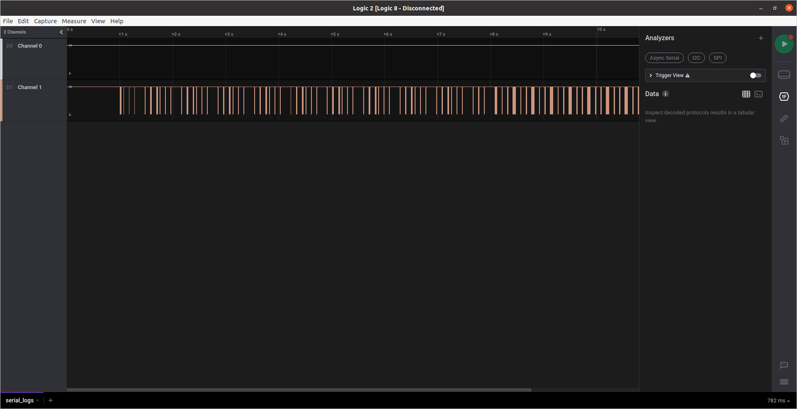
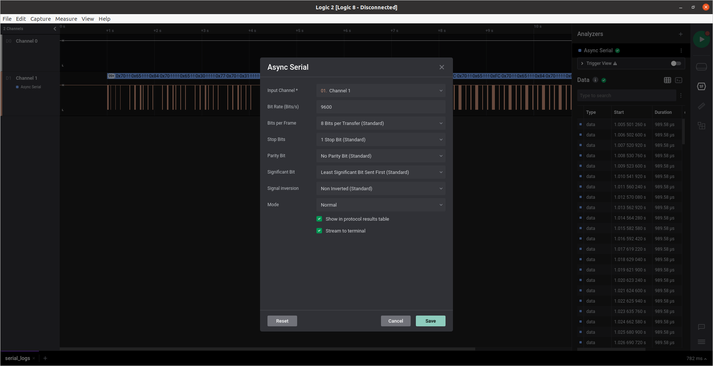
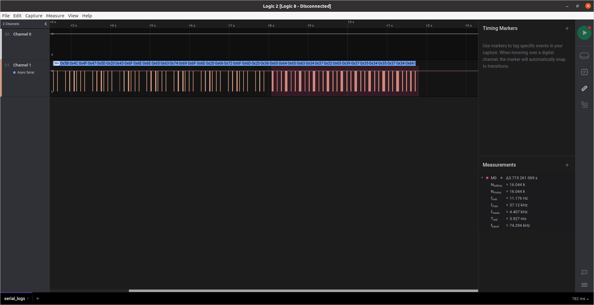

# Serial Logs

Challenge text:
```
We have gained physical access to the debugging interface of the Access Control System which is based on a Raspberry Pi-based IoT device. We believe that the log messages of this device contain valuable information of when our asset was abducted.
```
We are given the file [serial_logs.sal](serial_logs.sal). After a bit of research, I figure out that you can open these files using [Saleae's Logic 2 software](https://support.saleae.com/logic-software/sw-download).



As there's only one channel with data, the is probably sent through an asynchronous serial connection, so we have to use the async serial option in the analyzers tab.



However, we only see garbage data. My teammate experimented a bit with common baud rates, and using the baud rate 115200 we see actual data being output.
```
...

[LOG] Connection from 6edec472e9754574d91f460e170b825bacee5f121b73805dffa4f2a5a7d23d7f
[LOG] Connection from 316636cf0500c22f97fa261585b72a48c4625aca7868f0f6ee253937620ac15c
[LOG] Connection from 4b1186d29d6b97f290844407273044e5202ddf8922163077b4a82615fdb22376
[LOG] Connection from 4b1186d29d6b97f290844407273044e5202ddf8922163077b4a82615fdb22376
[LOG] Connection from 4b1186d29d6b97f290844407273044e5202ddf8922163077b4a82615fdb22376
[LOG] Connection from 4b1186d29d6b97f290844407273044e5202ddf8922163077b4a82615fdb22376
[LOG] Connection from ebd967f3ed47d5410160d3ee603884a32b426d5f3a84212697290c922407d45e
[LOG] Connection from ab290d3a380f04c2f0db98f42d5b7adea2bd0723fa38e0621fb3d7c1c2808284
[LOG] Connection from ea7372f07f7a18fcfe163ff48338076ec0de0cc4a435f0abbc6046db67a73dec
[LOG] Connection from 6edec472e9754574d91f460e170b825bacee5f121b73805dffa4f2a5a7d23d7f
[LOG] Connection from 316636cf0500c22f97fa261585b72a48c4625aca7868f0f6ee253937620ac15c
[LOG] Connection from 4b1186d29d6b97f290844407273044e5202ddf8922163077b4a82615fdb22376
[LOG] Connection from 4b1186d29d6b97f290844407273044e5202ddf8922163077b4a82615fdb22376
[LOG] Connection from 4b1186d29d6b97f290844407273044e5202ddf8922163077b4a82615fdb22376
[ERR] Noise detected in channel. Swithcing baud to backup value
\xEE\x1E\xEC~\x9E\x10\xF2\x1E|`~\x1C\xEE|\x9E\x1C\x0E\x1C\x1Eb\x9C\x8E|\x1E|\x1C\x8C\x9C\x8Er\x1E|\x8E\x0C\x9E|p\xE0|\x0E\x10\x1E\x1C\xE2p\x9C\x9Cpp\xE2p\x8E\x1C\x1C\x1C\xE2pp|\x8E\x90|\x8E\x80p\

...
```

As we don't know what the backup baud value is, and it probably isn't standard, I assumed it had to be calculated. Instead of doing this by hand, I instead found [this Logic 2 plugin that does it for me](https://github.com/jonathangjertsen/BaudRateEstimate). By measuring the last part of the data, it tells us the baud rate is approximately 74 300HZ. 



If I change the async serial settings to reflect this, we get the rest of the output.
```
...

[LOG] Connection from b1759332e4b7bc6b14b7b12b90d350f811144180e2129bdd313b85b1ee15e6b1
[LOG] Connection from ab290d3a380f04c2f0db98f42d5b7adea2bd0723fa38e0621fb3d7c1c2808284
[LOG] Connection from a7e6ec5bb39a554e97143d19d3bfa28a9bbef68fa6ecab3b3ef33919547278d4
[LOG] Connection from 099319f700d8d5f287387c81e6f20384c368a9de27f992f71c1de363c597afd4
[LOG] Connection from ab290d3a380f04c2f0db98f42d5b7adea2bd0723fa38e0621fb3d7c1c2808284
[LOG] Connection from CHTB{wh47?!_f23qu3ncy_h0pp1n9_1n_4_532141_p2070c01?!!!52}
[LOG] Connection from CHTB{wh47?!_f23qu3ncy_h0pp1n9_1n_4_532141_p2070c01?!!!52}
```